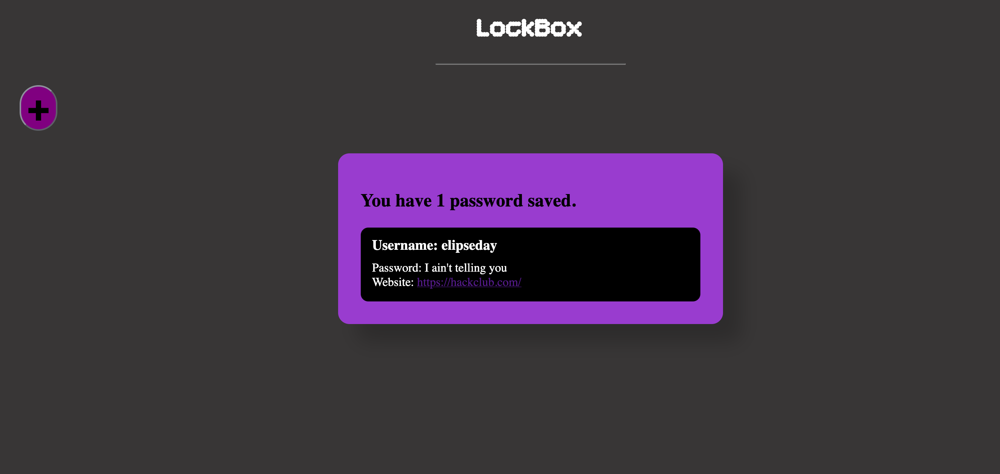
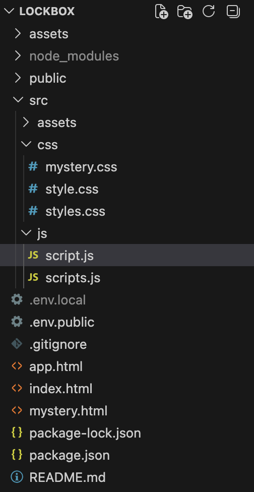

# LockBox
LockBox is a web password manager, save passwords. Play a fun little embedded mystery game! (that I did not make btw)


<br>

## How to use
The project is pretty self explanitory, if you can't understand for some reason you can watch the demo video

<a href="demo/demo.mov">Here</a>. You can only watch on mac or you have to manually convert it.

## File Structure



--------------------------------------------------

## Forking
```
git clone https://github.com/harshilarora250/lockbox/
cd lockbox
npm install
npm run dev
```

## Tech Stack
```
HTML
CSS
JS
```

## AI Usage
I used AI for bug fixes, js, and a little bit of css. I would recommend you looking over the lapse recordings for a better understanding. I would put the AI usage at around **15-20%**

## Time Recording (HackClub)
I used [lapse/lookout for time](https://lapse.hackclub.com/) recording because my Hackatime is inaccurate with time calculations. I am on a mac, it could be because of security reasons. I'm unfortunately unable to use hackatime since it also accessess all my files on my computer which I don't want, hope you can understand. Even if my doing stuff out of coding which is part of the tool I think it is still time spent towards the project, and I would say is stupid if time is deducted out of that.

## Contribution
This project was developed by [Harshil Arora](https://elipseday-nine.vercel.app) for #horizons (HackClub)